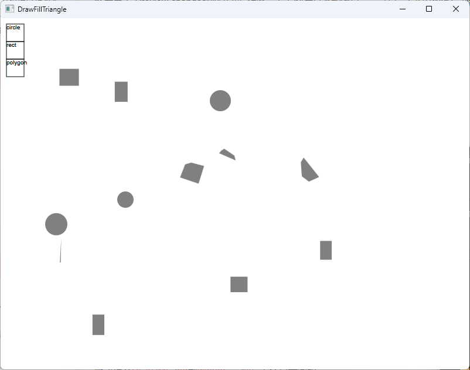

# 2DConvexPolygonCollisionDetectionAlgorithm
## 1.简介
这个项目为判断圆形与凸多边形碰撞判断与碰撞响应，附带Direct2D渲染实现与自制控件库。
## 2.Demo使用
由于该项目已经包含了窗口渲染与控件，所以可直接编译并运行Demo，同时添加随机的形状。运行界面如下所示：

在该Demo中，左上角的方框为按钮，由上到下的定义如下：
| 按钮名称 | 按下操作 | 抬起操作 |
|---|---|---|
| circle | 随机生成圆形 | 暂无 |
| rect | 随机生成矩形 | 暂无 |
| polygon | 随机生成多边形 | 暂无 |
### 2.1.Demo中的生成规则
所有图形的位置与大小为随机，具体范围在main.cpp中表示。**注意：该随机数的种子为固定值。**
## 3.碰撞实现
碰撞判断与碰撞响应的处理的具体过程在文档中阐述，以下仅描述粗略过程：
1. 碰撞处理的入口为`Ground`类中的函数`CollisionStart`。在入口里将所有图形两两进行碰撞判断与碰撞响应；
1. 对于任意两个图形将首先进行粗略判断；
1. 若粗略判断发现可能发生碰撞，则根据对应图形的形状进行SAT碰撞算法；
1. 根据SAT算法的返回值将两个图形移开。
## 4.当前不足
1. 当前碰撞响应为单独进行响应，并没有将发生在同一形状的响应做集中处理；
1. 当前仅为发生碰撞后进行挤开；
1. 当前物理量并未使用；
1. 文本框无法正确的处理富文本（如emoji）。
## 5.提交问题与补丁
请使用Issues。
## 6.参考
[twobitcoder101/FlatPhysics](https://github.com/twobitcoder101/FlatPhysics)
[uselessbaozi/ThreadPoolWithStatus](https://github.com/uselessbaozi/ThreadPoolWithStatus)